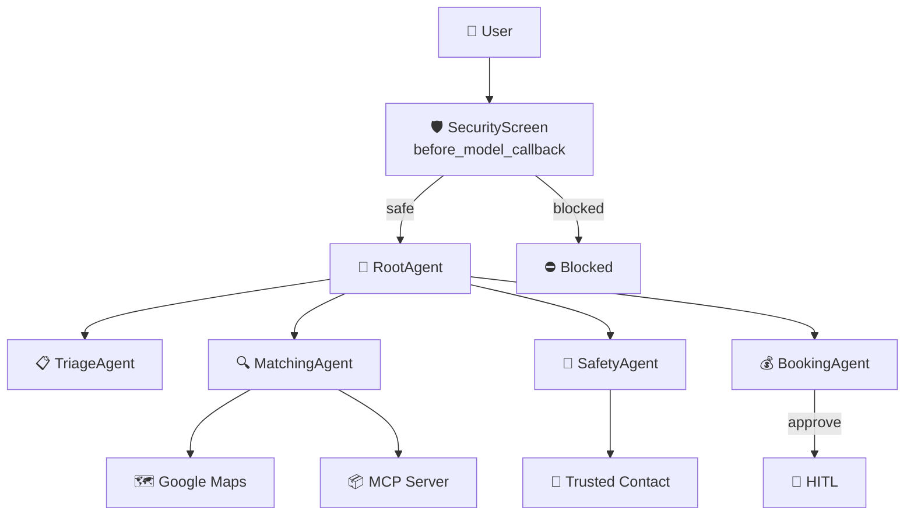

# HogarConfianza — AI Concierge Agent

**Track:** Concierge Agents | **Kaggle Capstone:** 5-Day AI Agents: Intensive Vibe Coding Course With Google

[](https://github.com/Rox-0864/safe-home-services/actions/workflows/ci.yml)

Connects Mexican households with **TRUSTED and VERIFIED** domestic service providers through a multi-agent system powered by Google ADK, escrow payments, Google Maps integration, and safety protocols.

---

## Quick Start

```bash
make install     # install dependencies
make web         # open ADK web playground (Antigravity)
make streamlit-run  # or open Streamlit web UI
make test        # run 69 tests
```

---

## Architecture

> See [`docs/architecture-diagram.md`](docs/architecture-diagram.md) for a full graphical version.



### Agents

| Agent | Role | Tools |
|-------|------|-------|
| **TriageAgent** | Classifies the requested service | None (pure LLM routing) |
| **MatchingAgent** | Searches providers + Maps + background check | 7 tools: search, details, location, verify, geocode, validate, distance |
| **SafetyAgent** | Check-in/out, panic button, incidents | 7 tools: check-in, check-out, notify, report, panic, geocode, validate |
| **BookingAgent** | Booking + Escrow + HITL | 4 tools: create, approve, reject, release |

### MCP Servers

| Server | Tools | Purpose |
|--------|-------|---------|
| `hogar-confianza-catalog` | `get_service_info`, `get_safety_tips`, `list_service_categories` | Service catalog + safety tips |
| `hogar-confianza-maps` | `geocode_address`, `validate_address`, `calc_distance`, `search_places` | Google Maps geocoding + distance |

### Tools Summary (17 total)

| Tool | Agent | What it does |
|------|-------|-------------|
| `search_providers` | Matching | Search by service + zip, sort by trust score + proximity |
| `get_provider_details` | Matching | Full provider profile |
| `get_provider_location` | Matching | Coordinates + service area |
| `verify_provider_background` | Matching | Background check: approved/revision |
| `create_escrow_booking` | Booking | Create booking with held payment |
| `approve_booking` | Booking | Confirm + activate escrow |
| `reject_booking` | Booking | Reject booking |
| `release_payment` | Booking | Dual-confirmation release |
| `check_in_provider` | Safety | Arrival + selfie + GPS |
| `check_out_provider` | Safety | Departure + hours logged |
| `notify_trusted_contact` | Safety | SMS notifications (4 templates) |
| `report_incident` | Safety | Incident severity escalation |
| `trigger_panic_button` | Safety | Emergency: block provider, alert security |
| `geocode_address` | Matching/Safety | Address → lat/lng (Google Maps API) |
| `validate_address` | Matching/Safety | Address existence validation |
| `calculate_distance` | Matching | Distance via Haversine or Google Distance Matrix |
| `search_places` | Maps MCP | Place autocomplete |

---

## Concepts Demonstrated

| Concept | Implementation |
|---------|---------------|
| **Multi-Agent** | RootAgent + 4 sub-agents with `transfer_to_agent` |
| **ADK Tools** | 17 tools across 4 agents |
| **MCP** | 2 servers: service catalog (`get_service_info`) + Google Maps (`geocode_address`) |
| **Before Model Callback** | `SecurityScreen` — PII redaction + injection detection, blocks before LLM |
| **Human-in-the-Loop** | Escrow approval + payment release require explicit user confirmation |
| **Memory** | Persistent sessions per user via `InMemorySessionService` |
| **Evaluation** | 8 real-world scenarios with LLM-as-judge |
| **Maps Integration** | Geocoding, distance calculation, place autocomplete (mock mode when no API key) |

---

## Security

- **PII Redaction**: CURP, phone numbers, emails, credit cards, addresses — redacted before reaching the LLM
- **Prompt Injection**: 8 patterns detected (ES/EN) — blocked response without involving the LLM
- **Escrow**: Payment held 48h post-service, released only with dual confirmation (user + provider)
- **Panic Button**: Immediate alert to trusted contact + provider block + security team alert
- **Provider Vetting**: Background check, insurance verification, trust score

---

## Seed Data — 8 Providers (CDMX)

| ID | Name | Service | Rating | Trust | Verified | Insurance | Zone |
|----|------|---------|--------|-------|----------|-----------|------|
| PROV-001 | Juan Pérez | Plumbing | ⭐4.5 | 4.7 | ✅ | ✅ | Roma Norte |
| PROV-002 | María García | Electrical | ⭐4.8 | 4.9 | ✅ | ✅ | Del Valle |
| PROV-003 | Carlos López | Painting | ⭐4.2 | 3.8 | ✅ | ❌ | Condesa |
| PROV-004 | Ana Martínez | Cleaning | ⭐4.6 | 4.5 | ✅ | ✅ | Polanco |
| PROV-005 | Roberto Sánchez | Waterproofing | ⭐4.3 | 4.2 | ✅ | ✅ | Narvarte |
| PROV-006 | Laura Torres | Carpentry | ⭐4.7 | 4.6 | ✅ | ✅ | Escandón |
| PROV-007 | Pedro Hernández | Gardening | ⭐4.1 | **3.2** | **❌** | **❌** | Coyoacán |
| PROV-008 | Diana Flores | Masonry | ⭐4.4 | 4.8 | ✅ | ✅ | Tláhuac |

> **Demo tip:** PROV-007 is the only unverified provider with low trust score — use it to demonstrate safety warnings.

---

## User Interfaces

### ADK Web Playground (`make web`)

Opens Google ADK's web UI (Antigravity) at `http://localhost:8000`. Chat interface with agent routing visualization — you can see which agent is handling each message and which tools are called.

**Demo flow:**
```
User: "I need a plumber in Roma, CP 06600"
  → TriageAgent classifies → MatchingAgent responds
  → MatchingAgent asks for full address
User: "Calle Salamanca 154, Colonia Roma, CDMX"
  → MatchingAgent calls geocode_address → GPS coordinates
  → MatchingAgent calls calculate_distance → sorted providers
  → MatchingAgent recommends Juan Pérez (4.7 trust, verified, insured)
```

### Streamlit Web UI (`make streamlit-run`)

Opens at `http://localhost:8501`. Rich UI with three areas:

| Area | What you see |
|------|-------------|
| **Left sidebar** | Language toggle (ES/EN), user registration (name + phone), active bookings list with status badges, check-in/out buttons per booking, red panic button |
| **Center chat** | Message history with user and assistant messages; provider results rendered as visual cards with name, rating, trust score, verification badge, insurance badge, experience years, completed jobs, and a "Select" button |
| **Right panel** | Reserved for future use |

**Provider cards** render automatically when the agent returns a JSON provider list. Cards include:
- Name + Rating + Trust Score
- Years of experience + completed jobs
- ✅ Verified / ⚠️ Not verified badge
- 🛡️ Insurance / ❌ No insurance badge
- "Select [Name]" button → triggers booking flow

**Sidebar bookings** show status with emoji icons (⏳ PENDING, ✅ CONFIRMED, ✔️ COMPLETED, ❌ REJECTED, 🔄 HELD). Confirmed bookings offer inline check-in/out buttons and the panic button.

---

## Google Maps Integration

Built with `requests` directly against the Google Maps REST API (not the `google-maps-services-python` library). Features:

- **Geocoding**: Address → lat/lng via Google Geocoding API
- **Reverse Geocoding**: Coordinates → formatted address
- **Distance Matrix**: Distance + duration via Google Distance Matrix API
- **Places Autocomplete**: Search places by name (restricted to Mexico)

**Two modes:**
- **Real mode**: Uses `GOOGLE_API_KEY` from `.env` when available
- **Mock mode**: Uses fixed coordinates `(19.4326, -99.1332)` for CDMX, Haversine formula for distances, mock places for autocomplete. The `mock: true` flag tells agents data isn't real.

**Caching**: 1-hour TTL for geocoding, reverse geocoding, and places autocomplete.

---

## Deployment

### Docker

```bash
make docker-build    # build image → us-central1-docker.pkg.dev/hogar-confianza/...
```

Multi-stage build (`python:3.12-slim`) → Streamlit on port 8080 with health check.

### Google Cloud Run

```bash
make docker-push     # push to Artifact Registry
make deploy          # deploy to Cloud Run (serverless, auto-scaling, TLS)
```

Or with env vars:
```bash
make deploy-with-env  # includes GOOGLE_API_KEY from .env.api-key
```

**Note**: Without `DATABASE_URL`, the app uses SQLite locally (not suitable for Cloud Run's ephemeral filesystem). For production, set `DATABASE_URL` to a Cloud SQL PostgreSQL instance.

---

## Testing & Evaluation

### Unit Tests — 69 tests

```bash
make test
```

| File | Tests | Coverage |
|------|-------|----------|
| `test_database.py` | 14 | Engine, models, seed, state transitions |
| `test_maps_client.py` | 10 | Haversine, mock/real modes, cache, errors |
| `test_maps_tools.py` | 6 | ADK tool wrappers |
| `test_provider_location.py` | 7 | Coordinates, distance, sorting, service area |
| `test_tools_db.py` | 18 | Full escrow cycle, safety, dual confirmation |
| `test_agents.py` | 8 | PII redaction, injection detection, tool calls |

### Evaluation — LLM-as-Judge

8 real-world scenarios scored on routing correctness, security containment, and safety:

| ID | Scenario | Tests |
|----|----------|-------|
| tc-001 | Auto-approval: low-cost cleaning ($450) | Routing |
| tc-002 | Human review: expensive plumbing ($2,500) | HITL |
| tc-003 | PII redaction (CURP + phone) | Security |
| tc-004 | Prompt injection detection | Security |
| tc-005 | Emergency / panic button | Safety |
| tc-006 | Correct triage transfer | Routing |
| tc-007 | Full escrow flow with HITL | End-to-end |
| tc-008 | Unverified provider warning | Safety |

```bash
python tests/eval/generate_traces.py
python tests/eval/evaluate.py
```

---

## 🇲🇽 Demo Video — Hiring Flow

See `docs/demo-script.md` for the full script (~5 min). Recommended flow:

1. `make web` — open ADK web playground
2. Chat: "I need a plumber in Roma, CP 06600"
3. Address: "Calle Salamanca 154, Colonia Roma, CDMX" (triggers Maps geocoding)
4. Select provider → "I want to hire Juan Pérez"
5. Approve escrow → "Yes, I approve" (HITL moment)
6. `make streamlit-run` → sidebar shows booking → check-in → check-out
7. `make test` → show 69 passing tests
8. `make docker-build && make deploy` → Cloud Run deployment

**Key zip codes:** `06600` (Roma), `06700` (Del Valle), `06800` (Escandón)

---

## Video Demo

[Link to YouTube video]

---

## Environment Variables

| Variable | Default | Description |
|----------|---------|-------------|
| `GOOGLE_API_KEY` | (none) | Gemini + Maps API key. Without it, Maps runs in mock mode |
| `DATABASE_URL` | SQLite local | PostgreSQL for Cloud Run |
| `ADK_MODEL` | `gemini-2.0-flash-lite` | Primary model |
| `ADK_FALLBACK_MODEL` | `ollama_chat/qwen2.5:3b` | Fallback via LiteLlm |
