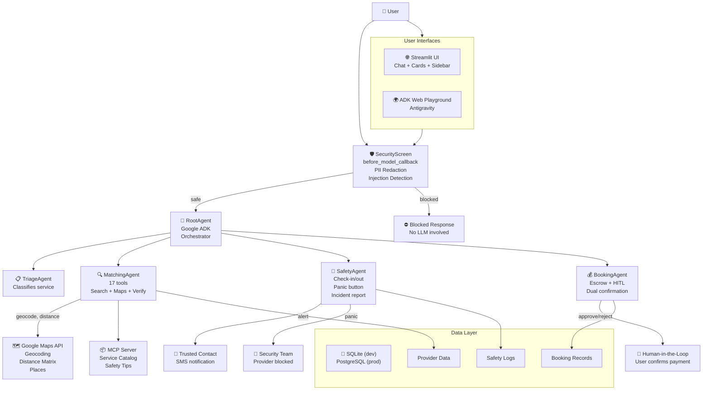

# HogarConfianza — Architecture Diagram

---

## Mermaid Diagram



---

## Compact ASCII Diagram

```
                    ┌─────────────────────────────────────┐
                    │            👤 USER                   │
                    │   Streamlit UI / ADK Web Playground   │
                    └──────────────┬──────────────────────┘
                                   │
                    ┌──────────────▼──────────────────────┐
                    │      🛡️ SECURITYSCREEN              │
                    │    before_model_callback             │
                    │  ┌──────────────────────────────┐   │
                    │  │  PII Redaction               │   │
                    │  │  (phone, email, CURP, card,  │   │
                    │  │   address)                   │   │
                    │  └──────────────────────────────┘   │
                    │  ┌──────────────────────────────┐   │
                    │  │  Prompt Injection Detection  │   │
                    │  │  (8 ES/EN patterns)          │   │
                    │  └──────────────────────────────┘   │
                    └──────┬──────────────────┬──────────┘
                           │ safe             │ blocked
                    ┌──────▼──────┐    ┌──────▼──────┐
                    │  ROOTAGENT  │    │  ⛔ BLOCKED  │
                    │  Google ADK │    │   RESPONSE   │
                    │ Orchestrator│    │              │
                    └──┬──┬──┬───┘    └─────────────┘
                       │  │  │
              ┌────────┘  │  └──────────┐
              │           │             │
       ┌──────▼────┐ ┌───▼────┐ ┌──────▼─────┐ ┌──────────▼─────┐
       │  TRIAGE   │ │MATCHING│ │   SAFETY   │ │    BOOKING     │
       │ Classify  │ │Search  │ │Check-in/out│ │   Escrow HITL  │
       │ service   │ │Maps    │ │Panic btn   │ │ Dual confirm   │
       │ (no tools)│ │Verify  │ │Incidents   │ │                │
       └───────────┘ └───┬────┘ └──────┬─────┘ └──────────┬─────┘
                         │             │                  │
              ┌──────────┤             │                  │
              ▼          ▼             ▼                  ▼
       ┌──────────┐ ┌──────────┐ ┌──────────┐ ┌────────────────┐
       │  MCP     │ │ GOOGLE  │ │ TRUSTED  │ │   PROVIDER     │
       │ Catalog  │ │ MAPS    │ │ CONTACT  │ │   DATABASE     │
       │ Safety   │ │ API     │ │ SMS      │ │   BOOKING DB   │
       │ Tips     │ │ Mock/   │ │ Security │ │   SAFETY LOGS  │
       │          │ │ Real    │ │ Team     │ │                │
       └──────────┘ └──────────┘ └──────────┘ └────────────────┘

                       DATA LAYER
       ┌─────────────────────────────────────────────────┐
       │  SQLite (dev) / PostgreSQL (prod via Cloud SQL) │
       │  ┌──────────┐ ┌──────────┐ ┌────────────────┐   │
       │  │Providers │ │ Bookings │ │ Safety Logs    │   │
       │  │8 seed    │ │ Escrow   │ │ Check-in/out   │   │
       │  │SQLModel  │ │ States   │ │ Panic events   │   │
       │  └──────────┘ └──────────┘ └────────────────┘   │
       └─────────────────────────────────────────────────┘
```

---

## Data Flow (Condensed)

```
User Input
    │
    ▼
┌────────────────────────────────────────────────────────────┐
│ before_model_callback: SecurityScreen                       │
│   1. redact_pii(): phone, email, CURP, credit_card, address │
│   2. detect_prompt_injection(): 8 patterns                  │
│   3. safe? → RootAgent  |  blocked? → return response      │
└────────────────────────────────────────────────────────────┘
    │
    ▼ (if safe)
┌────────────────────────────────────────────────────────────┐
│ RootAgent (LLM) decides routing:                            │
│   → transfer_to_triage   → classify service type           │
│   → transfer_to_matching → search + geocode + verify       │
│   → transfer_to_safety   → check-in/out + panic            │
│   → transfer_to_booking  → escrow + HITL approval          │
└────────────────────────────────────────────────────────────┘
```

---

## Tool-to-Agent Map

| Agent | Tools | Count |
|-------|-------|-------|
| **Matching** | `search_providers`, `get_provider_details`, `get_provider_location`, `verify_provider_background`, `geocode_address`, `validate_address`, `calculate_distance` | 7 |
| **Safety** | `check_in_provider`, `check_out_provider`, `notify_trusted_contact`, `report_incident`, `trigger_panic_button`, `geocode_address`, `validate_address` | 7 |
| **Booking** | `create_escrow_booking`, `approve_booking`, `reject_booking`, `release_payment` | 4 |

> **MCP Servers (shared):** `hogar-confianza-catalog` (service info + safety tips), `hogar-confianza-maps` (geocoding + distance + places)

---

## Key Architecture Decisions

| Decision | Choice | Rationale |
|----------|--------|-----------|
| Agent routing | Fixed sub-agents via `transfer_to_agent` | Simple, aligns with ADK design |
| Security | `before_model_callback` | PII redacted BEFORE LLM sees it |
| HITL | Explicit approve/reject for escrow > $100 | Financial safety, course requirement |
| Maps | REST API directly (no SDK) | Lighter dependency, full control |
| Mock mode | Fixed CDMX coords + Haversine | Works without API key for demo |
